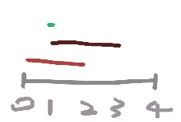

看到排列先嚇到一次，看內文又嚇一次，還以為要線段樹。

# 題目
requests表示好幾個區間，在nums所有可能排列下，求出所有區間和最大值。  
答案必須MOD 10^9+7。

# 解法
本想雙迴圈暴力計算每個位置的出現次數，看到測資n<=10^5直接放棄。  
使用psum陣列，在每個區間起點+1，終點後-1，做前綴和則可得到每個位置的次數。  
最後將psum和nums排序，相乘後相加即可。  

requests=[[0,2],[1,3],[1,1]], psum = [1,3,2,1,0]  



```python
class Solution:
    def maxSumRangeQuery(self, nums: List[int], requests: List[List[int]]) -> int:
        N = len(nums)
        psum = [0]*N
        for start, end in requests:
            psum[start] += 1
            if end+1 < N:
                psum[end+1] -= 1

        for i in range(1, N):
            psum[i] += psum[i-1]

        nums.sort()
        psum.sort()

        return sum([nums[i]*psum[i] for i in range(N)]) % (10**9+7)

```
